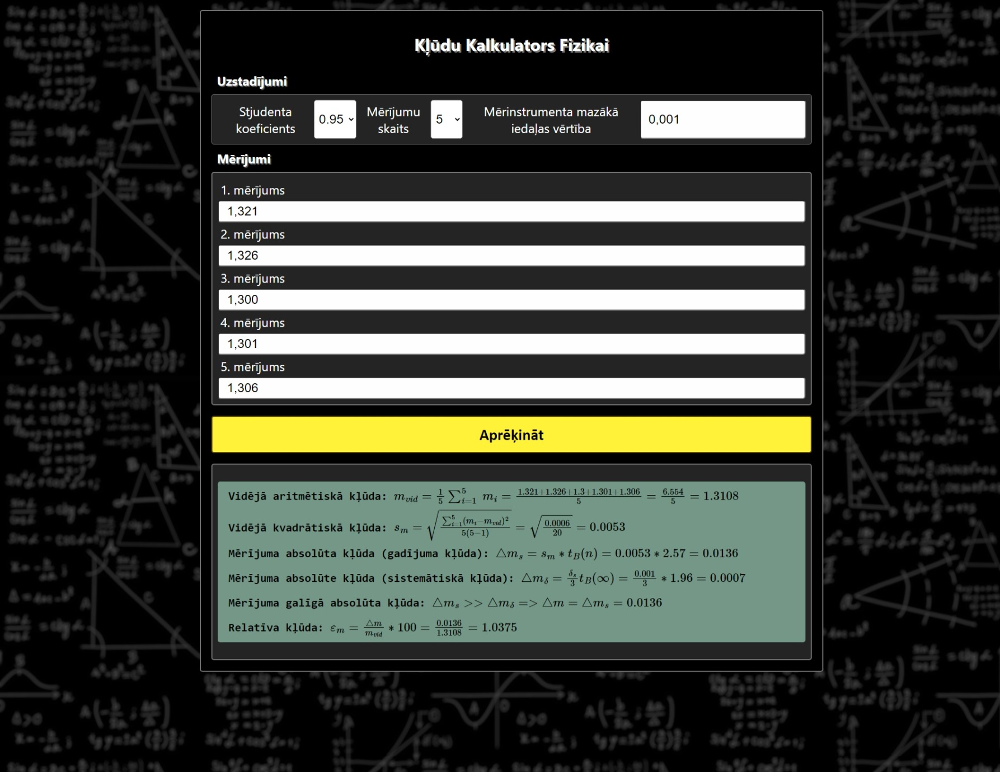

# Kļūdu Kalkulators Fizikai

Kalkulators izveidots tieši kļūdu aprēķinām _(vidēja aritmētiskā, vidēja kvadrātiskā, gadījuma, sistemātiskā, absolūta, relatīva kļūdas)_.

## Izskats:

    

## Īpašības:
- Iespēja izvēlēties no 2 līdz 25 mērījumiem, un aizpildīt tos atbilstoši;
- Stjudenta koeficientu izvēle un to izmantošana aprēķinos;
- Mērinstrumenta mazākas iedaļas vērtības ievade;
- Izvades īpašs attēlojums _(formulas un aprēķinu gaita)_.

## Izmantotas bibliotēkas un tehnoloģijas:
- HTML
- SCSS
- JavaScript
- React
- MathJax

Kalkulators ir pieejams [šeit][Kalkulators].

[Kalkulators]: https://wolferado.github.io/physics-calculator/