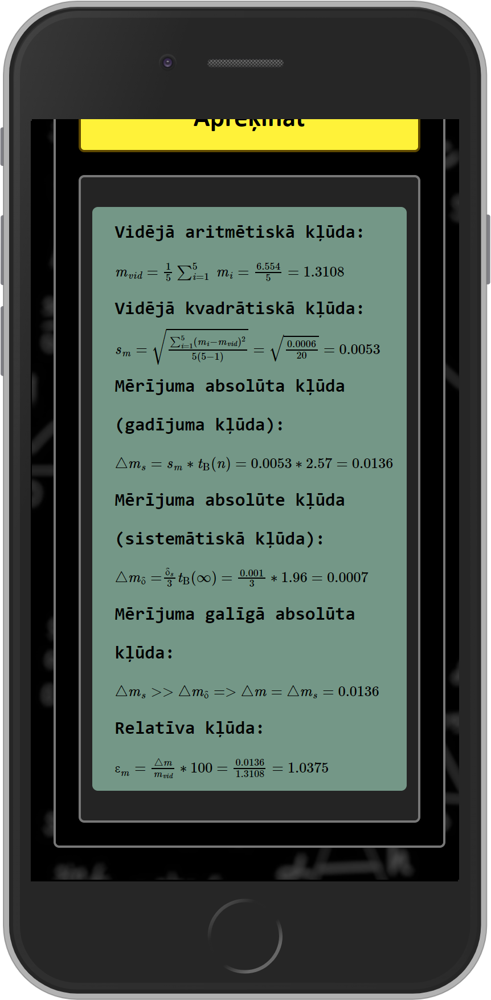

# Kļūdu Kalkulators Fizikai

Kalkulators izveidots tieši kļūdu aprēķinām _(vidēja aritmētiskā, vidēja kvadrātiskā, gadījuma, sistemātiskā, absolūta, relatīva kļūdas)_.

## Izskats:

    
    
    

## Īpašības:
- Iespēja izvēlēties no 2 līdz 25 mērījumiem, un aizpildīt tos atbilstoši;
- Stjudenta koeficientu izvēle un to izmantošana aprēķinos;
- Mērinstrumenta mazākas iedaļas vērtības ievade;
- Iespēja izvēlēties, vai mērinsturemnts ir analogs un vai viņam pieder precizitātes klase;
    - Precizitātes klases ievade;
    - Mērinstrumenta mērapjoma ievade.
- Izvades īpašs attēlojums _(formulas un aprēķinu gaita)_.

## Izmantotas bibliotēkas un tehnoloģijas:
- HTML
- SCSS
- JavaScript
- React
- MathJax

Kalkulators ir pieejams [šeit][Kalkulators].

### _Piezīmes:_
- Kalkulatorā ir iespējams satikt kļūdas. Kļūdas satikšanas gadījumā - izveidot "Issue" vai rakstīt privāti.
- Kalkulators izmanto parasto metodi kļūdu aprēķināšanai. Kalkulators nespēj pārciāli atvasināt un tā veidā meklēt kļūdas.

[Kalkulators]: https://wolferado.github.io/physics-calculator/